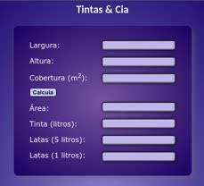

# Tinta

 
 

> Tinta

This project is a paint calculator implemented using HTML, CSS, and JavaScript. It allows users to calculate the amount of paint needed to cover a specific wall area in their house. Additionally, it calculates the number of 1-liter and 5-liter paint cans required to complete the painting job. It provides a user-friendly interface for inputting wall dimensions and displays the calculated results. A helpful tool for estimating paint quantities for home improvement projects.

## Features

Paint Calculator
* input wall dimensions
* input paint coverage
* calculate paint quantity
* calculate number of 1-liter and 5-liter paint cans

## Contributing

"If you'd like to contribute, please fork the repository and use a feature
branch. Pull requests are warmly welcome."

## Links

- Project homepage: https://github.com/phcrepaldi/paint
- Issue tracker:
  - In case of sensitive bugs like security vulnerabilities, please contact
    phcrepaldi@gmail.com directly instead of using issue tracker. We value your effort to improve the security and privacy of this project!

## Licensing

"The code in this project is licensed under MIT license."# paint
